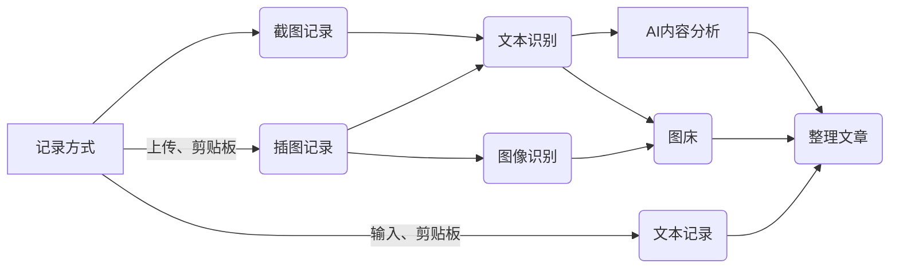

# NoteGen

NoteGen 是一款专注于**记录**和**写作**的跨端 AI 笔记工具，基于 `Tauri` + `ChatGPT` 开发。

它帮助用户通过**截图**、插图和文本等多种方式快捷地保存碎片化知识，并利用 AI 自动整理这些信息形成一篇可读的笔记。用户还可以通过内置的 Markdown 编辑器对 AI 生成的笔记进行二次创作。最终的笔记以文件形式存储于本地，同时支持`同步`与`图床`功能，这一切都基于 GitHub 实现，以确保数据的安全性。

## 快速开始

NoteGen 是一个跨平台的笔记 APP，目前支持 Mac、Windows、Linux，得益于 Tauri2 的跨平台能力，未来将支持 IOS、Android。

[下载 NoteGen](https://github.com/codexu/note-gen/releases)

如果你还不了解 NoteGen，你可以阅读使用文档，其中包含了快速上手指南：

[NoteGen 使用文档](https://github.com/codexu/note-gen/wiki)

## 记录

支持截图、插图和文本的多种记录方式，用户可以根据不同场景灵活选择最适合的记录形式。借助 ChatGPT 的强大功能，您无需担心记录的顺序和完整性，轻松捕捉灵感与信息，提升记录效率。

### 记录工作流

NoteGen 的核心就是如何高效的记录和内容的整理，以下是从记录到自动整理为笔记的工作流：

### 记录方式

1. **截图记录**是 NoteGen 的核心功能。通过截图，用户可以快速捕捉和记录碎片化知识，尤其是在遇到无法进行文本复制的情况下。其原理是通过 OCR 识别图片中的文字，再使用 ChatGPT 进行总结。
2. **文本记录**，可以确保内容的准确性，但是需要将文本复制至软件中，稍微增加了操作的复杂度。
3. **插图记录**，可以在笔记生成时，自动插入到合适的位置，你也可以复制图片，在打开 APP 时会自动识别辅助导入，如果配置了同步功能，将使用图床链接。

#### 标签

用户可以创建的标签，以便更好地归类和区分不同的记录场景。在文章生成时，这些标签及其对应的记录将会被删除（可选），从而保持内容的整洁和专注，当然其内容将在回收站中找回。

#### AI 对话

在你与 AI 对话时，默认关联当前标签下的记录，你也可以手动去关联写作内的任何文章。

#### 剪贴板识别

在你进行图片或文本复制后，切回到软件界面时，软件会自动识别剪贴板中的图片或文本，此条内容将在 AI 对话中出现，你可以将其插图到记录中。

#### 整理

当你在不断的记录中，积攒了足够的内容，你可以使用整理功能，自动将所有记录整理成一篇可读的笔记，有效节省了手动整理所需的时间，此功能具备以下几个特点：

- 支持输入个性化的需求。
- 无需关心记录顺序，由 ChatGPT 辅助你整理。
- 支持多种语言。

当你整理出一篇满意的笔记后，你可以将其转换为文章进行写作，它将笔记转换为 `.md` 文件存储于本地，并跳转至写作页面进行后续的完善工作。

## 写作

写作模式是基于文件管理器和 Markdown 编辑器组合实现的，即使你不使用记录功能，它也可以完全独立使用。

**文件管理器**

支持本地和 Github 仓库的文件和文件夹的管理，支持二级目录。

**版本管理**

Github 基于 Git 实现，所以天然支持版本管理，你可以在历史记录中回溯任何时刻的记录。

**AI 辅助**

基于 AI 实现在写作时支持问答、续写、优化、精简、翻译，并且可以随时将记录插入到文章任何位置。

**图床**

你可以直接复制图片粘贴在 Markdown 编辑器中，软件将自动将此图片上传至图床，并转换为 Markdown 图片链接。

**HTML 转 Markdown**

你可以更加方便的将网页上的内容复制到 Markdown 编辑器中，软件将自动将此内容转换为 Markdown 格式。

## 贡献

目前使用以下技术栈：

- [Tauri 2](https://v2.tauri.app/)
- [Next.js 15](https://nextjs.org/)
- [shadcn-ui](https://ui.shadcn.com/)
- [Tesseract.js](https://github.com/naptha/tesseract.js)
- [ChatGPT GPT-API-free](https://github.com/chatanywhere/GPT_API_free)

欢迎提交 PR 或 issue。

## Star History

