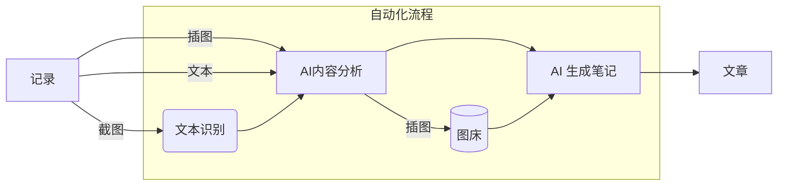

# NoteGen

NoteGen 是一个基于 Tauri + ChatGPT 的免费开源笔记 App，旨在帮助用户以**截图**、插图、文本的记录方式，快捷的保存碎片化知识，通过 AI 自动整理为一篇可读的笔记，通过内置的 Markdown 编辑器将 AI 笔记进行二次创作。笔记最终形态以文件存储于本地，同时也支持`同步`与`图床`功能，其基于 Github 实现，保证数据安全。

## 下载

NoteGen 是一个跨平台的笔记 APP，目前支持 `Mac`、`Windows`、`Linux`，得益于 Tauri2 的跨平台能力，未来将支持 `IOS`、`Android`。

[=> 下载 NoteGen <=](https://github.com/codexu/note-gen/releases)

## 快速上手

唯一的门槛就是需要拥有一个 Github 账号，并且可以流畅访问。

以下的配置工作在仅需在 1 分钟内完成：

### 1. 配置 ChatGPT API Key

NoteGen 使用了国内代理[GPT-API-free](https://github.com/chatanywhere/GPT_API_free)，可[申请领取内测免费API Key](https://api.chatanywhere.org/v1/oauth/free/render)，限制200请求/天，基本够用。

软件安装完毕后，请先在设置页面配置 API Key 后即可正常使用。

> 此功能只限制于 AI 相关功能，不影响正常写作。

### 2. 同步与图床（可选）

同步和图床基于 Github 仓库实现，需要[创建密钥](https://github.com/settings/tokens/new)，需勾选 `repo` 权限。

配置完成后，NoteGen 会自动创建两个仓库：

- `note-gen-image-sync`: 图床，使用 jsdelivr 加速。
- `note-gen-article-sync（私有）`: 用于存放笔记 `.md` 文件。

### 3. 仅限 Mac 用户

1. Mac 用户需要配置屏幕录制权限，才可以使用截图记录功能。
2. NoteGen 暂未签名，因此安装时会出现文件已损坏的提示，根据不同芯片解决方法如下：
  - Intel：[打开来自未知开发商的 Mac 应用程序](https://support.apple.com/zh-cn/guide/mac-help/mh40616/mac)。
  - Apple：打开终端并运行以下命令：`sudo xattr -r -d com.apple.quarantine /Applications/NoteGen.app`

## 工作流

NoteGen 的核心就是如何高效的记录和内容的整理，以下是从记录到自动整理为笔记的工作流：

## 记录

支持截图、插图和文本的多种记录方式，用户可以根据不同场景灵活选择最适合的记录形式。借助 ChatGPT 的强大功能，您无需担心记录的顺序和完整性，轻松捕捉灵感与信息，提升记录效率。

**记录方式**

1. **截图记录**是 NoteGen 的核心功能。通过截图，用户可以快速捕捉和记录碎片化知识，尤其是在遇到无法进行文本复制的情况下。其原理是通过 OCR 识别图片中的文字，再使用 ChatGPT 进行总结。
2. **文本记录**，可以确保内容的准确性，但是需要将文本复制至软件中，稍微增加了操作的复杂度。
3. **插图记录**，可以在笔记生成时，自动插入到合适的位置，你也可以复制图片，在打开 APP 时会自动识别辅助导入，如果配置了同步功能，将使用图床链接。

**标签**

用户可以创建的标签，以便更好地归类和区分不同的记录场景。在文章生成时，这些标签及其对应的记录将会被删除（可选），从而保持内容的整洁和专注，当然其内容将在回收站中找回。

**整理**

当你在不断的记录中，积攒了足够的内容，你可以使用整理功能，自动将所有记录整理成一篇可读的笔记，有效节省了手动整理所需的时间，此功能具备以下几个特点：

- 支持输入个性化的需求。
- 无需关心记录顺序，由 ChatGPT 辅助你整理。
- 支持多种语言。
- 支持控制笔记长度。
- 可多次整理，支持生成记录管理。

当你整理出一篇满意的笔记后，你可以将其转换为文章进行写作，它将笔记转换为 `.md` 文件存储于本地，并跳转至写作页面进行后续的完善工作。

## 写作

写作模式是基于文件管理器和 Markdown 编辑器组合实现的，即使你不使用记录功能，它也可以完全独立使用。

**文件管理器**

支持本地和 Github 仓库的文件和文件夹的管理，支持二级目录。

**版本管理**

Github 基于 Git 实现，所以天然支持版本管理，你可以在历史记录中回溯任何时刻的记录。

## 辅助功能

- [x] **写作辅助**，基于 AI 实现在写作时支持问答、续写、优化、精简、翻译，并且可以随时将记录插入到文章任何位置。
- [x] **图床**，基于 Github 仓库实现，需要配置密钥，支持图床管理。
- [x] **全局搜索**，支持全局模糊搜索，快速查询记录或文章，支持跳转。
- [x] **深色模式**，完全支持深色模式，支持自动跟随系统。
- [x] **剪贴板**，目前支持识别图片，可以快速作为插图记录。
- [x] **回收站**，记录并不会在数据中完全消失，可以方便地管理和恢复被删除或被使用的记录。
- [x] **主题**，支持多种 markdown 和代码块主题。
- [x] **模型切换**，现在你可以随时切换适合你的模型，为了节约，默认使用 GPT-4o-mini。
- [ ] **绘图**，支持流程图、思维导图、草图、图表、图片标注，并支持上传至图床。
- [ ] **AI识图**，目前以 OCR 识别插图文字，这种方式不能精确的判断整理时放置的位置，AI 识图可以增加整理效率。
- [ ] **平台管理**，平台管理配合写作，实现多平台管理，可在写作中实现快速发布。
- [ ] **格式转换**，默认以 `.md` 文件存储于本地，支持导出为 PDF、HTML 等其他格式。

## 贡献

目前使用以下技术栈：

- [Tauri 2](https://v2.tauri.app/)
- [Next.js 15](https://nextjs.org/)
- [shadcn-ui](https://ui.shadcn.com/)
- [Tesseract.js](https://github.com/naptha/tesseract.js)
- [ChatGPT GPT-API-free](https://github.com/chatanywhere/GPT_API_free)

欢迎提交 PR 或 issue。

## Star History

