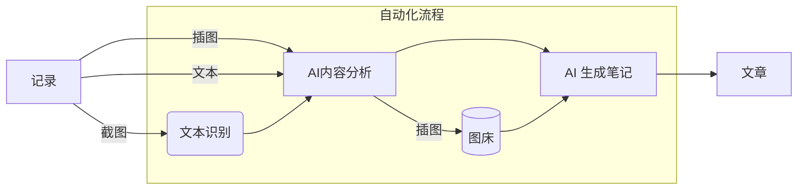

# NoteGen

NoteGen 是一个基于 Tauri + ChatGPT 的笔记软件，旨在帮助用户以**截图**、插图、文本的记录方式，快捷的保存碎片化知识，通过 AI 自动整理为一篇可读的笔记，通过内置的 Markdown 编辑器将 AI 笔记进行二次创作。笔记最终形态以文件存储于本地，同时也支持`同步`与`图床`功能，其基于 Github 实现，保证数据安全。

## 下载

NoteGen 是一个跨平台的笔记 APP，目前支持 Mac、Windows、Linux，得益于 Tauri2 的跨平台能力，未来将支持 IOS、Android。

[在此查询并选择下载 NoteGen！](https://github.com/codexu/note-gen/releases)

## 快速上手

### 1. 配置 ChatGPT API Key

NoteGen 使用了国内代理[GPT-API-free](https://github.com/chatanywhere/GPT_API_free)，可[申请领取内测免费API Key](https://api.chatanywhere.org/v1/oauth/free/render)，限制200请求/天，基本够用。

软件安装完毕后，请先在设置页面配置 API Key 后即可正常使用。

> 此功能只限制于 AI 相关功能，不影响正常写作。

### 2. 同步与图床（可选）

同步和图床基于 Github 仓库实现，需要[创建密钥](https://github.com/settings/tokens/new)，需勾选 `repo` 权限。

配置完成后，NoteGen 会自动创建两个仓库：

- `note-gen-image-sync`: 图床，使用 jsdelivr 加速。
- `note-gen-article-sync`: 用于存放笔记 `.md` 文件。

### 3. 权限

Mac 用户需要配置屏幕录制权限，才可以使用截图记录功能。

## 特性

在如今信息爆炸的时代，高效地记录和整理知识已成为许多用户的迫切需求。NoteGen 是一款创新性的笔记软件，能够大幅提升用户的记录与整理体验。无论是快速记忆灵感，还是系统化汇总信息，NoteGen 都能为用户提供灵活又高效的解决方案，让知识整理变得更加轻松、便捷。

### 工作流

### 记录

支持截图、插图和文本的多种记录方式，用户可以根据不同场景灵活选择最适合的记录形式。借助 ChatGPT 的强大功能，您无需担心记录的顺序和完整性，轻松捕捉灵感与信息，提升记录效率。

以下介绍三种不同的记录方式及对应的场景：

- **截图记录**是 NoteGen 的核心功能。通过截图，用户可以快速捕捉和记录碎片化知识，尤其是在遇到无法进行文本复制的情况下。其原理是通过 OCR 识别图片中的文字，再使用 ChatGPT 进行总结。
- **文本记录**，可以确保内容的准确性，但是需要将文本复制至软件中，稍微增加了操作的复杂度。
- **插图记录**，可以在笔记生成时，自动插入到合适的位置。

为了区分不同的知识记录，支持了标签功能。用户可以创建的标签，以便更好地归类和区分不同的记录场景。在文章生成时，这些标签及其对应的记录将会被删除，从而保持内容的整洁和专注。

### 生成

NoteGen 自动将所有记录整理成一篇可读性高的笔记，有效节省了手动整理所需的时间。

- 支持输入个性化的需求。
- 支持多种语言。
- 支持控制笔记长度。
- 笔记生成记录管理。

### 写作

支持文件管理器和 Markdown 编辑器，可以实现文章的管理、编辑和预览。

在编辑器中你同样可以享受到 ChatGPT 带来的便利，他支持了两种模式：

- **AI**，你可以在编辑器中编写需求，选中内容，随即将内容替换为 ChatGPT 提供的回复，适合在没有思路时使用。
- **优化**，将一段内容选中，ChatGPT 将优化你这段文字，适合无法表答清楚语义时使用。

### 图床

图床基于 Github 仓库实现，需要配置密钥，以支持图床的功能。

### 全局搜索

用户可以通过文字模糊查询，快速查找到相应的记录或者文章，支持跳转。

### 绘图

待实现，为了方便插入自定义图片，可以考虑支持以下绘图功能：流程图、思维导图、草图、图表、图片标注等。

### 回收站

待实现，内容并不会在数据中完全消失，而是会被转移到回收站。在那里，我们可以方便地管理和恢复被删除的项目，在垃圾中淘金。

### 平台管理

待实现，平台管理是配合写作的功能，支持多个平台，实现快速发布。

## 技术栈

- Tauri v2
- Next.js v15
- shadcn-ui
- Tailwind CSS
- TypeScript
- Tesseract.js OCR 识别
- GPT-API-free ChatGPT 国内代理
