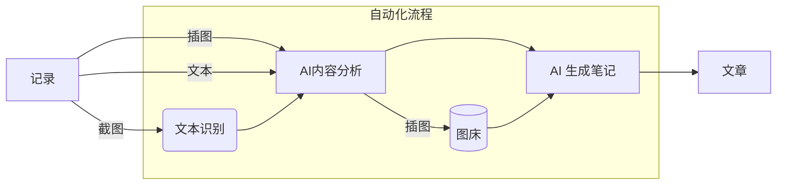

# NoteGen

NoteGen 是一个基于 Tauri + ChatGPT 的笔记软件，旨在帮助用户以截图、插图、文本的记录方式，快捷的保存碎片化知识，通过 AI 自动整理为一篇可读的笔记，通过内置的 Markdown 编辑器将 AI 笔记进行二次创作。

## 下载

NoteGen 是一个跨平台的笔记 APP，目前支持 Mac、Windows、Linux，得益于 Tauri2 的跨平台能力，未来将支持 IOS、Android。

[在此查询并选择下载 NoteGen！](https://github.com/codexu/note-gen/releases)

## 特性

NoteGen 是一个免费的开源项目，内置了国内可用的 ChatGPT 代理，用户每日可享受200次免费的调用服务。目前，该项目仍在开发阶段，但已成功实现了核心功能，期待未来为用户提供更多便捷的使用体验。

在如今信息爆炸的时代，高效地记录和整理知识已成为许多用户的迫切需求。NoteGen 是一款创新性的笔记软件，能够大幅提升用户的记录与整理体验。无论是快速记忆灵感，还是系统化汇总信息，NoteGen 都能为用户提供灵活又高效的解决方案，让知识整理变得更加轻松、便捷。

### 工作流

### 记录

支持截图、插图和文本的多种记录方式，用户可以根据不同场景灵活选择最适合的记录形式。借助 ChatGPT 的强大功能，您无需担心记录的顺序和完整性，轻松捕捉灵感与信息，提升记录效率。

以下介绍三种不同的记录方式及对应的场景：

- **截图记录**是 NoteGen 的核心功能。通过截图，用户可以快速捕捉和记录碎片化知识，尤其是在遇到无法进行文本复制的情况下。其原理是通过 OCR 识别图片中的文字，再使用 ChatGPT 进行总结。
- **文本记录**，可以确保内容的准确性，但是需要将文本复制至软件中，稍微增加了操作的复杂度。
- **插图记录**，可以在笔记生成时，自动插入到合适的位置。

为了区分不同的知识记录，支持了标签功能。用户可以创建的标签，以便更好地归类和区分不同的记录场景。在文章生成时，这些标签及其对应的记录将会被删除，从而保持内容的整洁和专注。

### 生成

NoteGen 自动将所有记录整理成一篇可读性高的笔记，有效节省了手动整理所需的时间。

- 支持输入个性化的需求。
- 支持多种语言。
- 支持控制笔记长度。
- 笔记生成记录管理。

### 写作

支持文件管理器和 Markdown 编辑器，可以实现文章的管理、编辑和预览。

在编辑器中你同样可以享受到 ChatGPT 带来的便利，他支持了两种模式：

- **AI**，你可以在编辑器中编写需求，选中内容，随即将内容替换为 ChatGPT 提供的回复，适合在没有思路时使用。
- **优化**，将一段内容选中，ChatGPT 将优化你这段文字，适合无法表答清楚语义时使用。

### 图床

待实现，将插图在生成文章时上传至图床，配背图床管理。

### 绘图

待实现，为了方便插入自定义图片，可以考虑支持以下绘图功能：流程图、思维导图、草图、图表、图片标注等。

### 收藏夹、全局搜索

待定功能，用户可以轻松保存或查找重要的信息，确保不遗漏有价值的知识碎片。

### 回收站

待实现，内容并不会在数据中完全消失，而是会被转移到回收站。在那里，我们可以方便地管理和恢复被删除的项目，在垃圾中淘金。

### 平台管理

待实现，平台管理是配合写作的功能，支持多个平台，实现快速发布。

### 其他

- 支持深色模式。
- 系统设置。
- 帮助（待实现）。

## 贡献

在 NoteGen 的开发过程中，我们鼓励社区的积极参与和贡献。无论您是开发者、设计师，还是只对软件的功能和用户体验有独到见解的用户，您的反馈和建议对我们来说都十分宝贵。

### 技术栈

- Tauri v2
- Next.js v15
- shadcn-ui
- Tailwind CSS
- TypeScript
- Tesseract.js OCR 识别
- GPT-API-free ChatGPT 国内代理

### 如何贡献

1. **代码贡献**：如果您是一名开发者，并且对我们的项目有兴趣，欢迎在 GitHub 上提交您的代码贡献。您可以通过创建新的功能、修复现有的错误或者优化代码来直接参与到 NoteGen 的发展中。

2. **BUG报告**：如果在使用 NoteGen 时您发现了任何问题或者 BUG，请在我们的 issue tracker 中报告。这将帮助我们更快地识别和修复问题，提升产品的稳定性和用户体验。

3. **功能建议**：我们也欢迎用户对软件功能的建议。请分享您希望 NoteGen 增加的功能，或者您在使用过程中遇到的困难。您的反馈是我们改进产品的重要依据。

4. **文档贡献**：如果您对文档内容有改进建议，或者希望为项目的使用指南和开发者文档贡献内容，请随时与我们联系。清晰而详细的文档可以帮助更多用户更好地使用 NoteGen。

5. **推广项目**：通过社交媒体、博客或者技术社区分享 NoteGen 也能为项目带来更多的用户和关注，同时帮助我们建立一个更活跃的用户社区。

感谢您的每一份贡献，让我们一起将 NoteGen 打造成更好的笔记工具！
